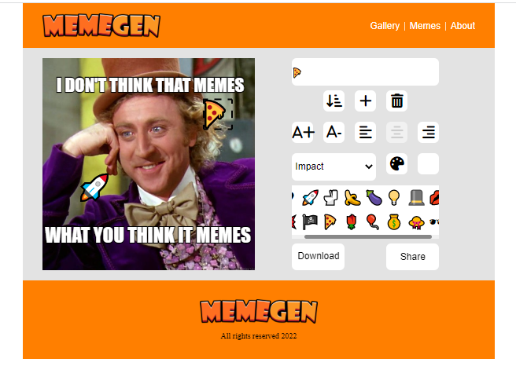

# meme-generator
> 😎 A small-scale web-app for generating your funniest memes.

## General Information
This project was carried out as part of the Coding Academy web development course as "Sprint #2" project. The goal was to create a meme generator app while practicing JavaScript basics, HTML canvas API and creating a basic UI. 

## Technologies Used
- HTML5
- CSS3
- JavaScript - ES6

## Screenshots

## Usage
- Simply chose an image from the gallery or upload one of your own. 
- In the editor use the text input to edit lines or use the buttons to: 
  - Move between lines, add lines or remove lines. 
  - Increase or decrease font size or change test alignment. 
  - Change font, fill color or stroke color.
  - Add icons
- You can also select lines by clicking them on the canvas or move them by drag and drop.
- When your meme is ready - click download and save your work.

## Project Status
Project is: _no longer being worked on_. 
Reason: Moved to work on higher scale projects.

## Room for Improvement
- Add more features.
- Improve style and UI.
